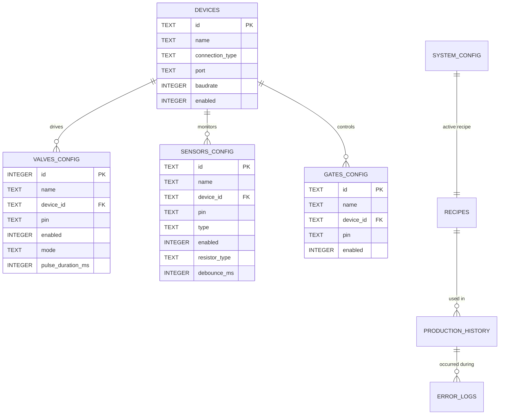

# PLGazoz Dinamik Donanım & Veritabanı Mimari Tasarımı

Bu belge, **PLGazoz** içecek şişeleme tesisinin simülasyon ortamından gerçek donanım ortamına geçişinde kullanılacak **tamamen dinamik donanım ve pin eşleme (Hardware & Pin Mapping)** destekli SQLite şemasını içermektedir.

---

## 1. Neden Dinamik Donanım Eşleme?

Endüstriyel hatlarda bir kontrol kartının (örneğin Nano-1) arızalanması durumunda, üretimin durmaması için kabloların sağlam olan diğer karta (Nano-2) veya doğrudan Raspberry Pi 5 GPIO pinlerine taşınabilmesi ve bu değişikliğin **kod yazmadan, arayüzden (HMI) dinamik olarak yapılabilmesi** gerekir.

Bu gereksinim doğrultusunda veritabanında donanımsal tanımlamaları içeren şu tablolar oluşturulmuştur:
*   `devices` (Kontrol Kartları: Nano-1, Nano-2, Pi 5 GPIO vb.)
*   `valves_config` (Valflerin hangi karta ve hangi pine bağlı olduğu)
*   `sensors_config` (Sayacı ve seviye sensörlerinin hangi karta ve pine bağlı olduğu)
*   `gates_config` (Pnömatik/Solenoid kapı kilitlerinin hangi karta ve pine bağlı olduğu)

---

## 2. Dinamik Donanım & Veritabanı İlişkisel Şeması



---

## 3. SQLite Veritabanı Tablo Tanımları (DDL)

### A. Donanım & Kart Tanımları Tablosu (`devices`)
Sisteme bağlı olan tüm mikrodenetleyici kartlarını ve Pi 5 GPIO veri yolunu tanımlar.

```sql
CREATE TABLE IF NOT EXISTS devices (
    id TEXT PRIMARY KEY,                       -- 'NANO-1', 'NANO-2', 'RASPI'
    name TEXT NOT NULL,                        -- Kart adı (örn: "Nano 1 - Röle Kartı")
    connection_type TEXT NOT NULL,             -- 'UART', 'USB', 'INTERNAL'
    port TEXT,                                 -- Örn: '/dev/ttyAMA0', '/dev/ttyUSB0'
    baudrate INTEGER DEFAULT 115200,           -- Seri haberleşme hızı
    enabled INTEGER DEFAULT 1                  -- Kart aktif mi? (1/0)
);
```

### B. Dinamik Valf Yapılandırma Tablosu (`valves_config`)
Hangi dolum vanasının (nozzle) hangi kartın hangi pinine bağlı olduğunu saklar. Bir kart arızalandığında valfin pini ve kart kimliği buradan güncellenir.

```sql
CREATE TABLE IF NOT EXISTS valves_config (
    id INTEGER PRIMARY KEY,                    -- Vana No (1 - 16)
    name TEXT NOT NULL,                        -- Vana Adı (örn: "Dolum Nozzle 1")
    device_id TEXT NOT NULL,                   -- Hangi karta bağlı? (devices.id)
    pin TEXT NOT NULL,                         -- Kart üzerindeki pin (örn: "D3", "GPIO21")
    enabled INTEGER DEFAULT 1,                 -- Vana aktif mi? (1/0)
    mode TEXT DEFAULT 'CONTINUOUS',            -- 'CONTINUOUS' veya 'PULSE'
    pulse_duration_ms INTEGER DEFAULT 1000,    -- Pulse modunda açık kalma süresi
    FOREIGN KEY (device_id) REFERENCES devices(id)
);
```

### C. Dinamik Sensör Yapılandırma Tablosu (`sensors_config`)
Şişe sayıcı lazer bariyerlerin ve HC-SR04 seviye sensörünün hangi kart ve pinde olduğunu saklar.

```sql
CREATE TABLE IF NOT EXISTS sensors_config (
    id TEXT PRIMARY KEY,                       -- 'SENS-IN', 'SENS-OUT', 'SENS-LEVEL'
    name TEXT NOT NULL,                        -- Sensör Adı (örn: "Giriş Şişe Sayıcı")
    device_id TEXT NOT NULL,                   -- Hangi karta bağlı? (devices.id)
    pin TEXT NOT NULL,                         -- Kart pini (örn: "D2", veya HC-SR04 için "D7,D8" trigger,echo)
    type TEXT NOT NULL,                        -- 'INPUT' (Giriş), 'OUTPUT' (Çıkış), 'LEVEL' (Seviye)
    enabled INTEGER DEFAULT 1,                 -- Sensör aktif mi? (1/0)
    resistor_type TEXT DEFAULT 'PULLUP',       -- 'PULLUP', 'PULLDOWN', 'NONE'
    debounce_ms INTEGER DEFAULT 35,            -- Parazit engelleme süresi (ms)
    FOREIGN KEY (device_id) REFERENCES devices(id)
);
```

### D. Dinamik Solenoid Kilit (Kapı) Yapılandırma Tablosu (`gates_config`)
Pnömatik/Solenoid kapıların (giriş ve çıkış kilitleri) kart ve pin eşleşmesini saklar.

```sql
CREATE TABLE IF NOT EXISTS gates_config (
    id TEXT PRIMARY KEY,                       -- 'GATE-IN', 'GATE-OUT'
    name TEXT NOT NULL,                        -- Kapı adı (örn: "Giriş Kilidi")
    device_id TEXT NOT NULL,                   -- Hangi karta bağlı?
    pin TEXT NOT NULL,                         -- Kart pini (örn: "D5")
    enabled INTEGER DEFAULT 1,                 -- Kapı aktif mi? (1/0)
    FOREIGN KEY (device_id) REFERENCES devices(id)
);
```

### E. Reçeteler Tablosu (`recipes`)
```sql
CREATE TABLE IF NOT EXISTS recipes (
    id TEXT PRIMARY KEY,
    name TEXT NOT NULL,
    volume_ml INTEGER NOT NULL,
    fill_time_ms INTEGER NOT NULL,
    settling_time_ms INTEGER NOT NULL,
    drip_wait_time_ms INTEGER NOT NULL,
    active_valves TEXT NOT NULL,              -- JSON Liste: "[1,2,3,4]"
    co2_pressure_bar REAL DEFAULT 4.0,
    syrup_ratio_percent REAL DEFAULT 12.0,
    target_temp_celsius REAL DEFAULT 4.0,
    carbonation_level TEXT DEFAULT 'YÜKSEK',
    capping_torque_nm REAL DEFAULT 2.4,
    description TEXT,
    is_system INTEGER DEFAULT 0
);
```

### F. Üretim Geçmişi Tablosu (`production_history`)
```sql
CREATE TABLE IF NOT EXISTS production_history (
    id INTEGER PRIMARY KEY AUTOINCREMENT,
    cycle_uuid TEXT NOT NULL UNIQUE,
    recipe_id TEXT NOT NULL,
    recipe_name TEXT NOT NULL,
    start_timestamp INTEGER NOT NULL,
    end_timestamp INTEGER NOT NULL,
    duration_ms INTEGER NOT NULL,
    input_count INTEGER NOT NULL,
    output_count INTEGER NOT NULL,
    status TEXT NOT NULL,
    operator_name TEXT DEFAULT 'Operatör',
    syrup_used_ml INTEGER NOT NULL,
    FOREIGN KEY (recipe_id) REFERENCES recipes(id)
);
```

### G. Arıza Kayıtları Tablosu (`error_logs`)
```sql
CREATE TABLE IF NOT EXISTS error_logs (
    id INTEGER PRIMARY KEY AUTOINCREMENT,
    timestamp INTEGER NOT NULL,
    error_code TEXT NOT NULL,
    severity TEXT NOT NULL,
    message TEXT NOT NULL,
    suggestion TEXT,
    cycle_uuid TEXT,
    resolved INTEGER DEFAULT 0,
    resolved_timestamp INTEGER,
    FOREIGN KEY (cycle_uuid) REFERENCES production_history(cycle_uuid)
);
```

### H. Sistem Yapılandırma Tablosu (`system_config`)
```sql
CREATE TABLE IF NOT EXISTS system_config (
    id INTEGER PRIMARY KEY CHECK (id = 1),
    active_recipe_id TEXT NOT NULL,
    target_count INTEGER DEFAULT 4,
    tank_capacity_ml INTEGER DEFAULT 50000,
    current_tank_volume_ml INTEGER DEFAULT 50000,
    watchdog_timeout_ms INTEGER DEFAULT 15000,
    auto_recovery INTEGER DEFAULT 1,
    log_level TEXT DEFAULT 'INFO',
    refill_lower_limit_ml INTEGER DEFAULT 5000,
    FOREIGN KEY (active_recipe_id) REFERENCES recipes(id)
);
```

---

## 4. Dinamik Seed (Başlangıç) Verileri

Sistem ilk kurulduğunda veritabanında donanım haritalarını oluşturan seed sorguları:

```sql
-- Cihazları Tanımla (Varsayılan Yerleşim)
INSERT OR IGNORE INTO devices (id, name, connection_type, port, baudrate, enabled) VALUES
('Valfler', 'Nano 1 - Röle Kartı (Valfler)', 'UART', '/dev/ttyAMA0', 115200, 1),
('Sensors', 'Nano 2 - Sensör & Kilit (Sensors)', 'USB', '/dev/ttyUSB0', 115200, 1),
('RASPI', 'Raspberry Pi 5 GPIO', 'INTERNAL', NULL, NULL, 1);

-- 8 Dolum Valfi + 1 Şerbet Besleme Valfini Tanımla (Varsayılan olarak hepsi Valfler kartında)
INSERT OR IGNORE INTO valves_config (id, name, device_id, pin, enabled, mode, pulse_duration_ms) VALUES
(1, 'Dolum Nozzle 1', 'Valfler', 'D2', 1, 'CONTINUOUS', 1000),
(2, 'Dolum Nozzle 2', 'Valfler', 'D3', 1, 'CONTINUOUS', 1000),
(3, 'Dolum Nozzle 3', 'Valfler', 'D4', 1, 'CONTINUOUS', 1000),
(4, 'Dolum Nozzle 4', 'Valfler', 'D5', 1, 'CONTINUOUS', 1000),
(5, 'Dolum Nozzle 5', 'Valfler', 'D6', 1, 'CONTINUOUS', 1000),
(6, 'Dolum Nozzle 6', 'Valfler', 'D7', 1, 'CONTINUOUS', 1000),
(7, 'Dolum Nozzle 7', 'Valfler', 'D8', 1, 'CONTINUOUS', 1000),
(8, 'Dolum Nozzle 8', 'Valfler', 'D9', 1, 'CONTINUOUS', 1000),
(9, 'Şerbet Tank Besleme Valfi', 'Valfler', 'D10', 1, 'CONTINUOUS', 1000);

-- Sensörleri Tanımla (Varsayılan olarak Sensors kartında)
INSERT OR IGNORE INTO sensors_config (id, name, device_id, pin, type, enabled, resistor_type, debounce_ms) VALUES
('SENS-IN', 'Giriş Şişe Bariyeri', 'Sensors', 'D2', 'INPUT', 1, 'PULLUP', 35),
('SENS-OUT', 'Çıkış Şişe Bariyeri', 'Sensors', 'D3', 'OUTPUT', 1, 'PULLUP', 35),
-- HC-SR04 için Trigger=D7, Echo=D8 pinlerini virgülle ayırarak saklıyoruz
('SENS-LEVEL', 'HC-SR04 Seviye Sensörü', 'Sensors', 'D7,D8', 'LEVEL', 1, 'NONE', 0);

-- Kapıları Tanımla (Varsayılan olarak Sensors kartında)
INSERT OR IGNORE INTO gates_config (id, name, device_id, pin, enabled) VALUES
('GATE-IN', 'Giriş Selenoid Kilidi', 'Sensors', 'D5', 1),
('GATE-OUT', 'Çıkış Selenoid Kilidi', 'Sensors', 'D6', 1);

-- Reçeteleri ve Yapılandırmayı Tanımla
INSERT OR IGNORE INTO recipes (id, name, volume_ml, fill_time_ms, settling_time_ms, drip_wait_time_ms, active_valves, co2_pressure_bar, syrup_ratio_percent, target_temp_celsius, carbonation_level, capping_torque_nm, description, is_system) VALUES
('REC-SADE', 'Klasik Sade Gazoz (250ml)', 250, 2400, 600, 1000, '[1,2,3,4]', 4.2, 12.0, 4.0, 'YÜKSEK', 2.4, 'Geleneksel limon aromalı klasik sade gazoz.', 1),
('REC-MANDALINA', 'Bodrum Mandalinası Gazozu (250ml)', 250, 2600, 700, 1200, '[5,6,7,8]', 3.8, 14.5, 4.5, 'ORTA', 2.3, 'Bodrum mandalina konsantreli gazoz formülü.', 1);

INSERT OR IGNORE INTO system_config (id, active_recipe_id, target_count, tank_capacity_ml, current_tank_volume_ml, watchdog_timeout_ms, auto_recovery, log_level, refill_lower_limit_ml) VALUES
(1, 'REC-SADE', 4, 50000, 48500, 15000, 1, 'INFO', 5000);
```

---

## 5. Dinamik Yapıda Backend Çalışma Mantığı

Bu şema ile Python Backend dinamik yönlendirmeyi şu şekilde yapacaktır:

1.  **Valf Tetikleme Sırasında:**
    *   Backend `VALVE:ON:1` isteği aldığında veritabanından vana 1'in eşleşmesine bakar: `device_id = 'Valfler'`, `pin = 'D2'`.
    *   Haberleşme yöneticisine gidip `'Valfler'` portunu bulur ve o porta `VALVE:ON:D2\n` komutunu yazar.
    *   Eğer vana 1'i `RASPI` portuna (`GPIO21`) taşıdıysanız, Python yerel `RPi.GPIO` kütüphanesini kullanarak Pi'nin 21 numaralı fiziksel pinini HIGH konumuna çeker.
2.  **Sensör Olayı Alındığında:**
    *   `Sensors` portundan `EVENT:PIN:D2:ACTIVE\n` mesajı geldiğinde, backend veritabanını tarar: `device_id = 'Sensors'` ve `pin = 'D2'` olan sensörü bulur (`SENS-IN`).
    *   Dolum döngü makinesine "Şişe Giriş Yaptı" sinyalini dinamik olarak iletir.
